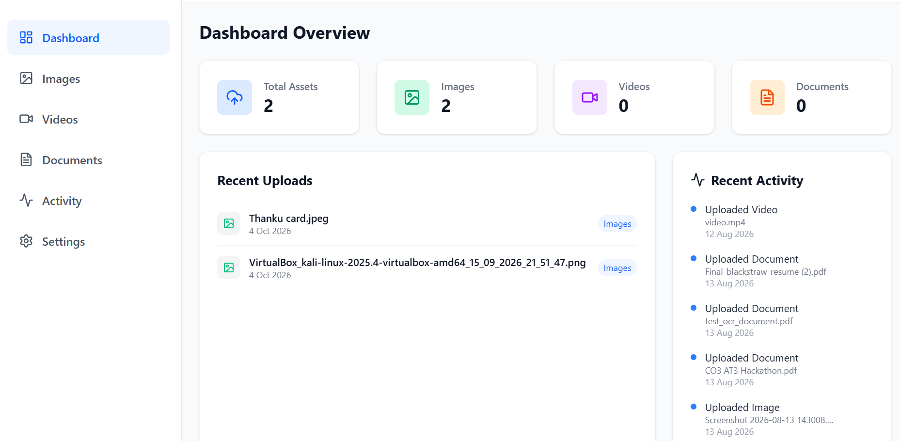
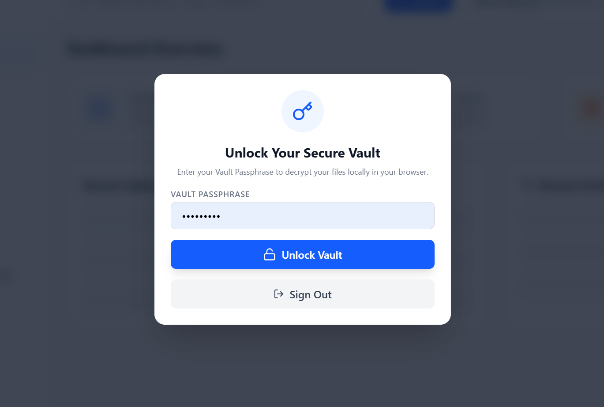
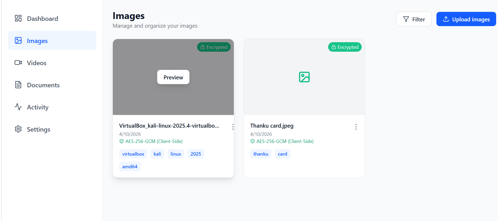
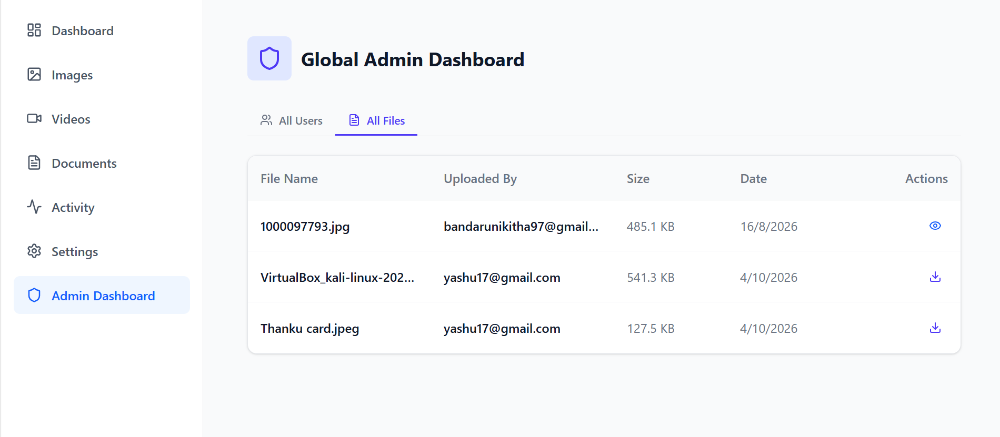

# 🛡️ Privacy-Preserving Browser-Encrypted Cloud Storage System

A highly secure, full-stack cloud storage application built with a **Zero-Knowledge Architecture**. This system ensures that user files are encrypted locally in the browser *before* they are transmitted to the server, guaranteeing that not even the server administrators can view the contents of the files.

## 🚀 Live Demo
**Frontend:** [https://privacy-preserving-browser-encrypte.vercel.app](https://privacy-preserving-browser-encrypte.vercel.app)  
*(Note: The backend is hosted on a free Render instance and may take ~50 seconds to wake up on the first request).*

## 🛠️ Tech Stack
* **Frontend:** React, TypeScript, Tailwind CSS, Vite
* **Cryptography:** Web Crypto API (AES-256-GCM)
* **Backend:** Java, Spring Boot, Spring Security
* **Database:** MongoDB (GridFS for binary file storage)
* **Authentication:** Firebase Authentication (JWT)
* **Deployment:** Vercel (Frontend), Render.com (Backend), MongoDB Atlas (Database)

## 🔒 Zero-Knowledge Architecture & Security Flow
This application was designed with strict privacy-preserving principles:

1. **Client-Side Encryption:** When a user uploads a file, they must first unlock their local "Vault" using a custom passphrase. 
2. **AES-256-GCM:** The browser uses the Web Crypto API to encrypt the raw file bytes locally using the passphrase.
3. **Secure Transmission:** Only the encrypted binary blob (ciphertext) is sent to the Java backend. The plaintext file and the passphrase *never* leave the user's browser.
4. **GridFS Storage:** The Spring Boot backend securely stores the encrypted blob into MongoDB using GridFS, bypassing standard file size limits.
5. **Stateless Authentication:** Every API request is verified using a Firebase JWT token, intercepted and validated by a custom `OncePerRequestFilter` in Spring Security.
6. **Client-Side Decryption:** When downloading, the encrypted blob is pulled from MongoDB, sent to the browser, and decrypted entirely on the client side using the user's local passphrase.

## ⚙️ Features
* **Google OAuth & Email Auth:** Secure login via Firebase.
* **Personal Secure Vault:** Files cannot be decrypted without the exact passphrase used during encryption.
* **Admin Dashboard:** Role-based access control allowing the administrator to view aggregated user statistics.
* **Responsive UI:** Fully mobile-responsive interface built with Tailwind CSS.

## 📸 Application Screenshots

### Main Dashboard


### Secure Vault Login


### Encrypted Files Gallery


### Global Admin Dashboard


## 💻 Local Development Setup

**1. Clone the repository:**
```bash
git clone https://github.com/nikithabandaru/privacy-preserving-browser-encrypted-system.git
2. Start the Frontend:
cd frontend
npm install
npm run dev
3. Start the Java Backend:
cd backend
# Note: Requires setting up a local application-secret.properties with MongoDB credentials
mvn spring-boot:run
